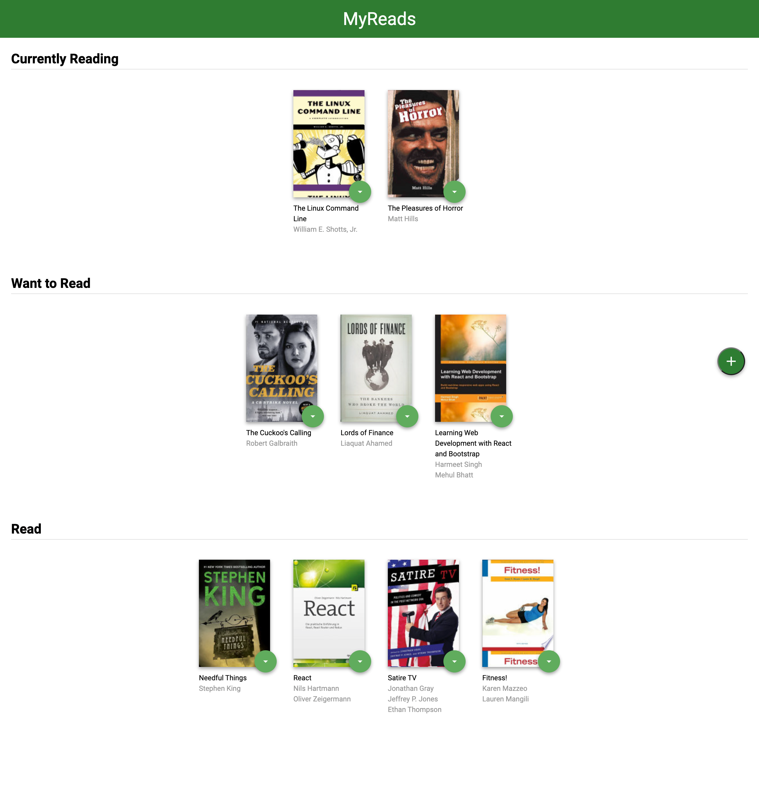
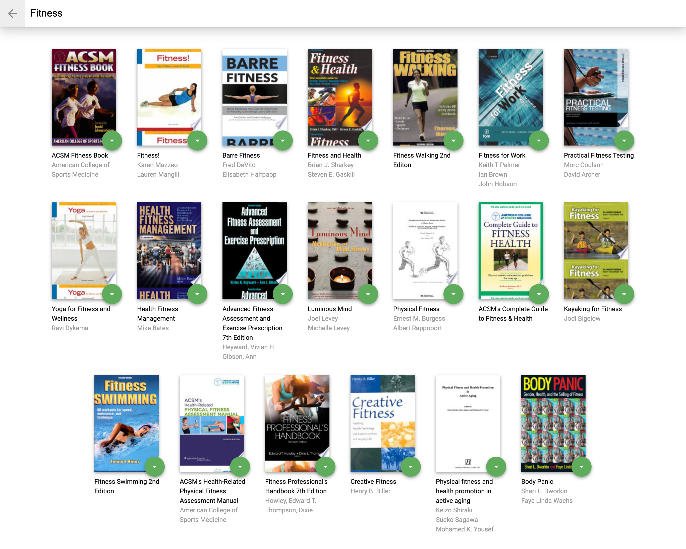

[![LinkedIn][linkedin-shield]][linkedin-url]

 

  <h1 align="center">MyReads Project</h1>

  

    Project created by:   <strong> Jose Luis Chavez Guerra </strong>
     
    <a href="https://keen-darwin-cb3671.netlify.app/"><strong>View Project »</strong></a>
     
     
    ·
    <a href="https://github.com/guerracode/myreads/issues">Report Bug</a>
    ·
    <a href="https://github.com/guerracode/myreads/issues">Request Feature</a>
  

<!-- ABOUT THE PROJECT -->

## About the Project

MyReads is a project created at Udacity React Nanodegree Program. The goal is to create a bookshelf app that allows you to select and categorize books you have read, are currently reading, or want to read. To add more books there's a search page where you can find more books and add them to the bookshelf with its category.

### Build with

These are the main technologies used in the project:

-  JavaScript
-  React
-  CSS
-  HTML

## Project Images

<!-- GETTING STARTED -->

## Getting Started

-  install all project dependencies with `npm install`
-  start the development server with `npm start`

Or view the page directly by clicking on this [link](https://keen-darwin-cb3671.netlify.app/)

<!-- CONTRIBUTING -->
 
 
 

## Contributing

Contributions are what make the open source community such an amazing place to be learn, inspire, and create. Any contributions you make are **greatly appreciated**.

1. Fork the Project
2. Create your Feature Branch (`git checkout -b feature/AmazingFeature`)
3. Commit your Changes (`git commit -m 'Add some AmazingFeature'`)
4. Push to the Branch (`git push origin feature/AmazingFeature`)
5. Open a Pull Request

## Contact

Jose Luis Chavez - [@guerracode](https://twitter.com/guerracode) - josephsiul15@gmail.com

Project Link: [GitHub](https://github.com/guerracode/myreads)

<!-- LINKS -->

[linkedin-shield]: https://img.shields.io/badge/-LinkedIn-black.svg?style=flat-square&logo=linkedin&colorB=555
[linkedin-url]: https://www.linkedin.com/in/jose-luis-chavez/
